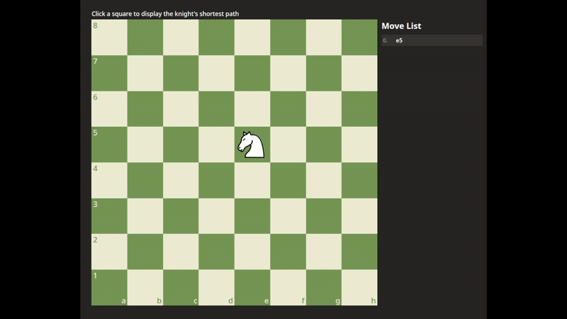

# How Does The Knight Move

A website to show the shortest path for a knight on a chess board using a breadth first search algorithm. Built with HTML5, CSS3, and JavaScript (ES6+), bundled and optimized using Webpack.

👉 [Live Demo](https://ckyever.github.io/how-does-the-knight-move)

## Acknowledgement

Inspired from [The Odin Project](https://www.theodinproject.com/lessons/javascript-knights-travails)

## License

- [MIT License](https://opensource.org/license/MIT)
- Copyright © 2025 Ckyever Gaviola
